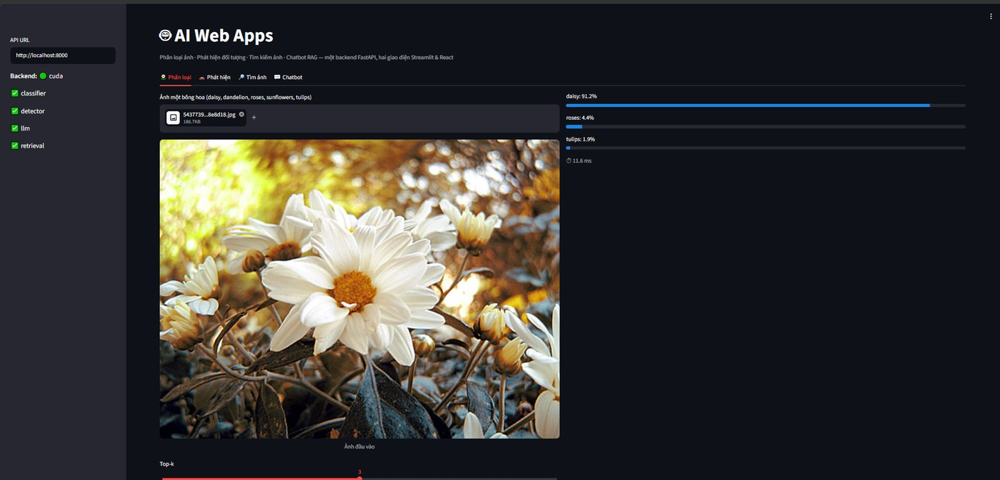
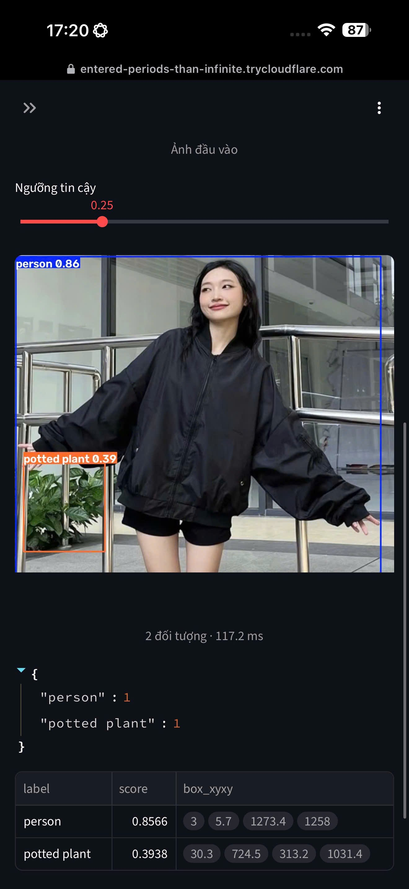
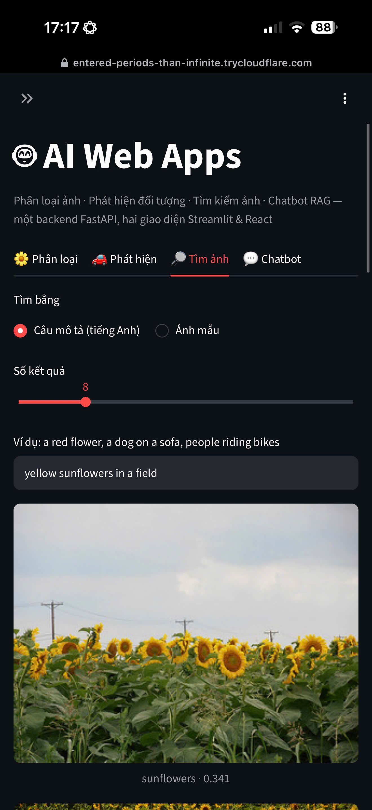
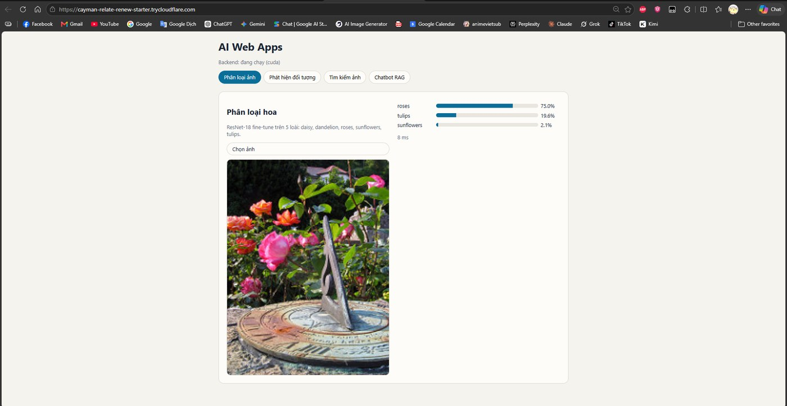
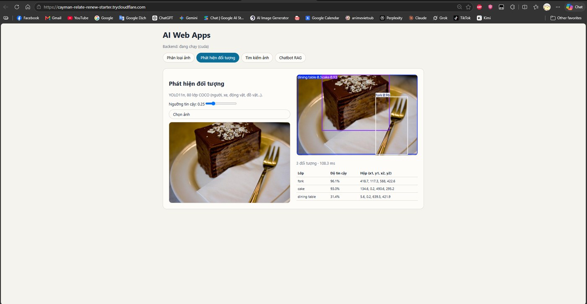
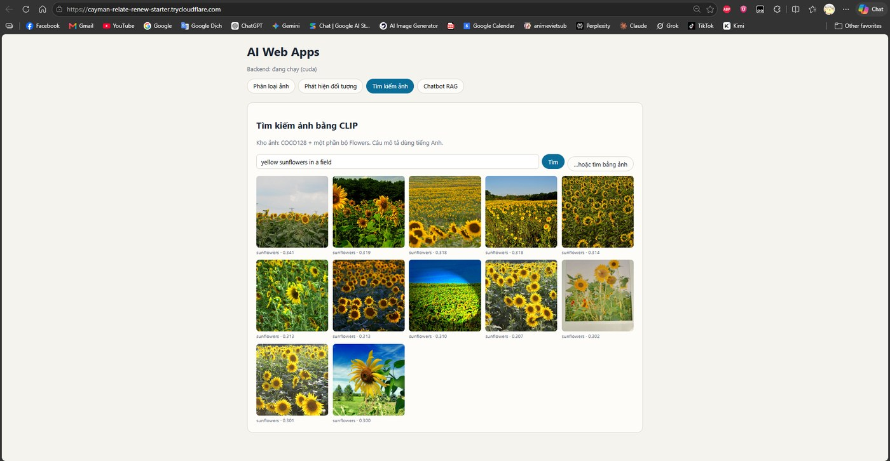
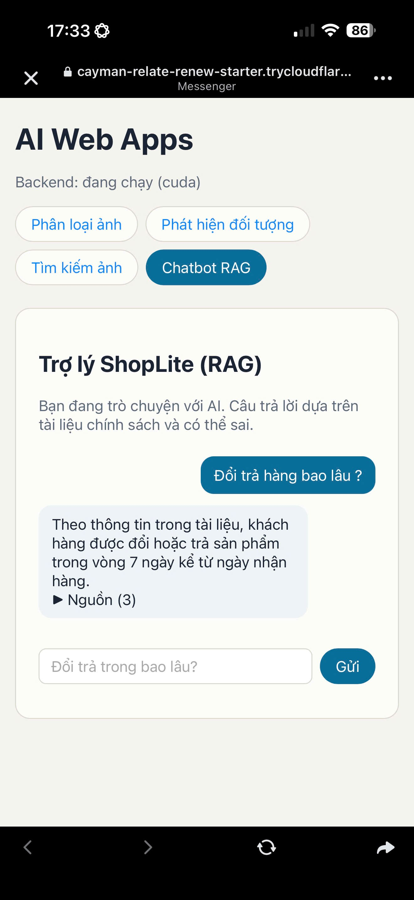
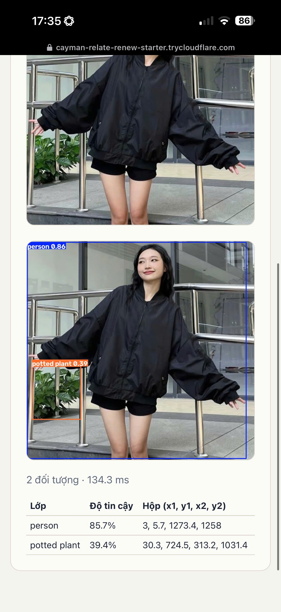

# Vườn Hoa AI — Streamlit & React

📊 **[Slide về cách làm — bản 1 trang](docs/slide-cach-lam.pptx)** (bản nộp chính) &nbsp;·&nbsp; **[bản 5 trang](docs/slide-cach-lam-5-trang.pptx)** &nbsp;·&nbsp; 📝 **[Tổng hợp cách làm](docs/cach-lam-tong-hop.md)** &nbsp;·&nbsp; 📷 **[Ảnh giao diện](#ảnh-giao-diện)** &nbsp;·&nbsp; 📄 **[Model card](MODEL_CARD.md)**

Bốn ứng dụng AI sau **một** backend FastAPI, với hai giao diện web (Streamlit và React).

| # | Ứng dụng | Mô hình | Dữ liệu (tự tải) | Chỉ số |
|---|---|---|---|---|
| 1 | Nhận diện loài hoa | ResNet-18 fine-tune | TF Flowers — 3.670 ảnh, 5 lớp | Accuracy, macro-F1, ma trận nhầm lẫn |
| 2 | Phát hiện đối tượng | YOLO11n (COCO, 80 lớp) | COCO128 — 128 ảnh có nhãn | mAP50, mAP50-95 |
| 3 | Tìm kiếm ảnh | CLIP ViT-B/32 + FAISS | COCO128 + 100 ảnh/loài hoa | Precision@5, Precision@10 |
| 4 | Cô làm vườn (chatbot RAG) | Qwen2.5-Instruct + MiniLM + FAISS (RAG) | 8 tài liệu chăm sóc hoa (tiếng Việt) | Hit@1, Hit@3 |

```
Trình duyệt ──► Streamlit (8501) ─┐
                                  ├──► FastAPI (8000) ──► core/ (4 mô hình, nạp 1 lần)
Trình duyệt ──► React (web/dist) ─┘
```

`core/` chỉ chứa suy luận · `api/` bọc thành HTTP · `streamlit_app.py` và `web/` chỉ là giao diện.
Đổi mô hình không phải sửa giao diện.

## Ảnh giao diện

Chụp từ phiên chạy thật trên **Colab T4 (Tesla T4, 16 GB VRAM)**, truy cập qua Cloudflare Tunnel.
Danh sách đầy đủ và ý nghĩa từng ảnh: [docs/screenshots/](docs/screenshots/).

<table>
<tr>
<td width="50%"><a href="docs/screenshots/01-streamlit-tong-quan.jpg"></a><br>
<sub><b>Streamlit — khởi động</b>: sidebar báo <code>Backend: 🟢 cuda</code>, cả 4 mô hình đã nạp ✅, và <b>chức năng 1 (phân loại ảnh)</b> trả về <code>daisy 91.2%</code> trong 11.6 ms</sub></td>
<td width="50%"><a href="docs/screenshots/02-streamlit-phat-hien.jpg"></a><br>
<sub><b>Chức năng 2 — phát hiện đối tượng</b> (Streamlit): YOLO11n vẽ hộp lên ảnh, trả về <code>{person: 1, potted plant: 1}</code> kèm bảng toạ độ</sub></td>
</tr>
<tr>
<td width="50%"><a href="docs/screenshots/03-streamlit-tim-anh.jpg"></a><br>
<sub><b>Chức năng 3 — tìm kiếm ảnh</b> (Streamlit): gõ câu mô tả <i>“yellow sunflowers in a field”</i>, trả về ảnh xếp theo điểm tương đồng</sub></td>
<td width="50%"><a href="docs/screenshots/04-react-phan-loai.jpg"></a><br>
<sub><b>Giao diện thứ hai (React)</b> — chức năng 1: <code>roses 75.0% · tulips 19.6% · sunflowers 2.1%</code>, 8 ms</sub></td>
</tr>
<tr>
<td width="50%"><a href="docs/screenshots/05-react-phat-hien.jpg"></a><br>
<sub><b>React</b> — chức năng 2: <code>fork 96.1% · cake 93.0% · dining table 31.4%</code>, bảng 3 cột Lớp / Độ tin cậy / Hộp</sub></td>
<td width="50%"><a href="docs/screenshots/06-react-tim-anh.jpg"></a><br>
<sub><b>React</b> — chức năng 3: lưới kết quả kèm nhãn và điểm, tìm được cả bằng câu mô tả lẫn ảnh mẫu</sub></td>
</tr>
<tr>
<td width="50%"><a href="docs/screenshots/07-react-chatbot.jpg"></a><br>
<sub><b>Chức năng 4 — chatbot RAG</b>: trả lời đúng <i>“7 ngày”</i> theo tài liệu và có <code>Nguồn (3)</code> để người đọc tự kiểm</sub></td>
<td width="50%"><a href="docs/screenshots/08-tren-dien-thoai.jpg"></a><br>
<sub><b>Chạy trên điện thoại</b> — cùng một link công khai, không cần cài gì</sub></td>
</tr>
</table>

## 1. Yêu cầu môi trường

| Thành phần | Phiên bản | Ghi chú |
|---|---|---|
| Python | **3.11 – 3.14** | Đã thử trên Windows/Python 3.14 với torch 2.14 CPU + faiss-cpu 1.15.1 |
| Node | **≥ 22.12** | Vite 8 yêu cầu Node ≥ 20.19 hoặc ≥ 22.12 |
| GPU | không bắt buộc | CPU chạy được cả 4 mô hình; tự giảm còn 1 epoch / 800 ảnh train và LLM 0.5B |

## 2. Chạy trên máy (Windows / Linux / macOS)

```bash
py -3 -m venv .venv
.venv\Scripts\activate                 # Linux/macOS: source .venv/bin/activate
pip install -r requirements.txt -r requirements-dev.txt
python scripts/serve.py api            # artifacts/ và data/gallery/ đã có sẵn trong repo
```

Muốn sinh lại từ đầu (không cần thiết): `python scripts/build_artifacts.py all` — ~15 phút trên GPU,
1–2 giờ trên CPU.

Trên máy **không có GPU NVIDIA**, `pip install torch` từ PyPI đã là bản CPU nên không cần làm gì thêm.
Chạy trên CPU vẫn ra đủ 4 bộ artifacts, nhưng classifier chỉ học 1 epoch trên 800 ảnh
(test accuracy thực đo ~0.68, so với ~0.9x khi chạy đủ 5 epoch trên GPU) — **dùng CPU để thử luồng,
không dùng để lấy số nộp bài.**

Mở `http://localhost:8000/docs` để thử API, hoặc chạy giao diện:

```bash
python scripts/serve.py streamlit                      # http://localhost:8501
cd web && npm install && npm run build                 # React build → API phục vụ tại :8000
python scripts/serve.py web                            # hoặc để script tự chạy 2 lệnh trên
```

`python scripts/serve.py all` chạy một lượt: build React → API → Streamlit → tunnel.

## 3. Chạy trên Google Colab (khuyến nghị — T4, 16 GB VRAM)

**Bật GPU trước:** Runtime → Change runtime type → **T4 GPU**. `config.py` tính `DEVICE` lúc import,
nên đổi runtime sau khi đã chạy thì phải Restart.

Mỗi ô dán riêng một cell. Dùng `requirements-colab.txt` (không cài lại torch vì Colab đã có bản khớp CUDA):

```python
!git clone https://github.com/MMMAlonea04/AI_Web_Apps_Streamlit_React.git /content/ai_web_apps
```

```python
%cd /content/ai_web_apps          # %cd giữ thư mục cho các cell sau; !cd thì không
```

```python
!pip install -q -r requirements-colab.txt
```

```python
!python scripts/build_artifacts.py all          # ~15–25 phút trên T4
```

Bước này **chỉ cần khi muốn huấn luyện/lập chỉ mục lại**. Repo đã kèm sẵn `artifacts/` và
`data/gallery/` sinh từ chính lần chạy T4 này, nên muốn demo ngay thì bỏ qua cell trên và đi tiếp.

Sinh xong artifacts thì **sao lưu ngay** — `/content` mất khi hết phiên. Phải mount Drive trước:

```python
from google.colab import drive; drive.mount('/content/drive')
```

```python
!mkdir -p /content/drive/MyDrive/ai_web_apps && cp -r artifacts data/gallery /content/drive/MyDrive/ai_web_apps/
```

Rồi chạy demo và lấy link công khai:

```python
!python scripts/serve.py all
```

`serve.py` tự cài Node 22 nếu bản Node của Colab quá cũ cho Vite 8 (chỉ chạy được khi có quyền root,
tức là trên Colab/Colab-like). Nếu chỉ muốn API, dùng `python scripts/serve.py api`.

> Link `*.trycloudflare.com` chỉ sống khi phiên Colab còn chạy. Triển khai lâu dài xem mục 6.

## 4. Từng bước sinh artifacts

`scripts/build_artifacts.py` gom các cell rời của notebook thành 5 stage chạy theo thứ tự cố định:

| Stage | Việc | Kết quả |
|---|---|---|
| `data` | Tải TF Flowers, COCO128 + biểu đồ EDA | `data/flowers/`, `data/coco128/`, `artifacts/figures/01_du_lieu.png` |
| `classifier` | Fine-tune ResNet-18, chọn checkpoint theo val, đánh giá 1 lần trên test | `artifacts/classifier/{model.pt,classes.json,split.json,metrics.json}` |
| `detector` | Tải YOLO11n, chạy ảnh mẫu, eval trên COCO128 | `artifacts/detector/{yolo11n.pt,metrics.json}` |
| `retrieval` | Gắn nhãn COCO bằng YOLO, dựng gallery, encode CLIP, build FAISS, đo Precision | `data/gallery/`, `artifacts/retrieval/{index.faiss,meta.json,metrics.json}` |
| `rag` | Chunk tài liệu, embedding MiniLM, eval Hit@k, nạp LLM hỏi thử | `artifacts/{rag_metrics.json,rag_probe.json}` |

```bash
python scripts/build_artifacts.py data                 # chỉ tải dữ liệu
python scripts/build_artifacts.py classifier --epochs 5 --batch-size 64
```

Batch size tự giảm còn 16 nếu VRAM < 6 GB (MX150 2 GB), nên không bị `CUDA out of memory`.

## 5. Kiểm thử

```bash
python -m pytest                      # test API bằng mô hình giả, ~2 giây, không cần GPU
```

Test trong `tests/test_api.py` thay mô hình thật bằng bản giả qua `MODELS` của `api.main`, nên không cần
torch hay artifacts. Cùng lệnh này chạy trong GitHub Actions (`.github/workflows/ci.yml`).

Kiểm thử thật (cần artifacts): `python scripts/smoke_test.py` khi API đang chạy — máy local hay bản đã
triển khai đều được, chỉ cần đặt `API_URL` trỏ tới đó.

## 6. Triển khai

Hai bản đang chạy công khai, cùng một cơ chế (React tĩnh trên Netlify, backend Colab + Cloudflare Tunnel tự công bố địa chỉ qua gist):

| Bản | Giao diện React | Backend |
|---|---|---|
| **Vườn Hoa AI** (bản mới, nhánh `test`) | `https://vuon-hoa-ai.netlify.app` | Colab T4 + tunnel — đổi mỗi phiên, công bố qua gist riêng |
| AI Web Apps (bản nhóm đã nộp) | `https://ai-web-aapp.netlify.app` | như trên, gist riêng của bài nhóm |

Phiên Colab cho site **Vườn Hoa AI** (clone nhánh `test`, công bố vào gist mới):

```python
!git clone -b test https://github.com/MMMAlonea04/AI_Web_Apps_Streamlit_React.git /content/vuon_hoa_ai
%cd /content/vuon_hoa_ai
!pip install -q -r requirements-colab.txt
import os
from google.colab import userdata
os.environ["GH_TOKEN"] = userdata.get("GH_TOKEN")     # token ghi gist — phải đẩy ra TRƯỚC khi chạy
os.environ["GIST_ID"] = userdata.get("GIST_ID")       # ← gist mới của site này (7b956575…)
os.environ["CORS_ORIGINS"] = "https://vuon-hoa-ai.netlify.app"
!python scripts/serve.py all
```

### 6.1 Backend → Colab + Cloudflare Tunnel (miễn phí, có GPU)

```bash
# trên Colab, đã clone repo và pip install -r requirements-colab.txt (xem mục 3)
export CORS_ORIGINS="https://<tên-site>.netlify.app"   # để bản React trên Netlify gọi được API
python scripts/serve.py all
```

`serve.py all` lần lượt build React → chạy API → chạy Streamlit → mở tunnel rồi in ra các link. Link
`*.trycloudflare.com` **chỉ sống khi phiên Colab còn chạy** — dùng cho demo/bảo vệ, không phải host 24/7.

Vì chính link tunnel đó cũng phục vụ luôn bản React đã build, cách gọn nhất để có *một* link là mở thẳng
link tunnel: React gọi API cùng origin nên không cần `CORS_ORIGINS`.

### 6.2 React → Netlify (một bản build dùng với mọi backend)

Netlify đọc `netlify.toml`: base `web`, `npm run build`, publish `dist`, `NODE_VERSION=22` (Vite 8 cần
Node ≥ 20.19 hoặc ≥ 22.12). Nối repo GitHub để Netlify tự build mỗi lần push, hoặc build tại máy rồi kéo
thả thư mục `web/dist` vào https://app.netlify.com/drop.

Địa chỉ backend được đọc **lúc chạy**, theo thứ tự ưu tiên: `?api=…` → `window.API_URL` → gist công bố
→ `localStorage` → `VITE_API_URL` (lúc build) → cùng origin; còn nguồn gist lấy từ `?discovery=…` →
`localStorage` → `VITE_API_DISCOVERY` (lúc build) — xem `web/src/api.js`. Nhờ vậy link tunnel đổi mỗi
phiên cũng không phải build lại:

```
https://<tên-site>.netlify.app/?api=https://<link-tunnel>.trycloudflare.com
```

Địa chỉ này được ghi vào `localStorage`, các lần sau chỉ cần mở `https://<tên-site>.netlify.app` — địa chỉ
đang dùng hiện ngay dưới tiêu đề trang kèm nguồn (`từ gist công bố`, `nhớ từ lần trước`…). Nếu backend đã
chạy mà trang vẫn báo không kết nối thì kiểm `CORS_ORIGINS` phía API có đúng tên miền Netlify.

#### Tự nối mỗi phiên: gist công bố

Dán `?api=` mỗi phiên thì phiền, mà `localStorage` cũng giữ địa chỉ cũ sau khi phiên Colab kết thúc. Cách
tự động: để `serve.py` công bố link tunnel mới lên một **gist công khai**, còn giao diện đọc gist đó trước
khi gọi API.

Chuẩn bị một lần:

1. Tạo **public gist** với file tên `api.json`, nội dung `{"api": ""}`, rồi lấy ID ở cuối URL gist.
   (Giao diện cũng chấp nhận file `.json` đặt tên khác, miễn nội dung có khoá `api`.)
2. Tạo GitHub token **chỉ có quyền ghi gist**: token *classic* thì tick đúng scope `gist`; token
   *fine-grained* thì chọn **User permissions → Gists → Read and write** (`PATCH /gists/{id}` cần `write`,
   xem [bảng quyền của GitHub](https://docs.github.com/en/rest/authentication/permissions-required-for-fine-grained-personal-access-tokens)).
   Lưu token vào Colab Secrets tên `GH_TOKEN`, và ID gist vào `GIST_ID`, rồi bật **Notebook access** cho cả hai.
3. Trên Netlify thêm biến build-time `VITE_API_DISCOVERY=https://api.github.com/gists/<id-gist>` rồi deploy lại.
   Dùng cách kéo-thả thì làm theo mục dưới.

Sau đó mỗi phiên, cell Colab phải đẩy secret vào biến môi trường **trước** khi chạy, vì `!python …` là
tiến trình con nên không đọc được `userdata` của kernel:

```python
import os
from google.colab import userdata
os.environ["GH_TOKEN"] = userdata.get("GH_TOKEN")
os.environ["GIST_ID"] = userdata.get("GIST_ID")
os.environ["CORS_ORIGINS"] = "https://<tên-site>.netlify.app"
!python scripts/serve.py all
```

Log sẽ in `📣 Đã công bố địa chỉ backend: …`, và mở `https://<tên-site>.netlify.app` là vào thẳng, không
cần dán gì. Nếu API và tunnel đang chạy sẵn, công bố lại chỉ tốn một lệnh:

```python
from scripts.colab_utils import publish_api_url   # chạy trong /content/ai_web_apps
publish_api_url("https://<link-tunnel>.trycloudflare.com")
```

Muốn công bố địa chỉ khác (named tunnel, host 24/7…) thì dùng
`python scripts/serve.py all --publish https://<địa-chỉ>`.

Hai điều cần biết: gist **thắng** `localStorage`, nên `?api=` chỉ có tác dụng cho lần mở đó; và
`api.github.com` giới hạn 60 request/giờ mỗi IP — quá đủ cho demo, nhưng nếu thấy gist không cập nhật thì
kiểm rate limit.

#### Deploy bằng kéo-thả (không nối GitHub)

Dashboard Netlify không có chỗ sửa file, nên với cách kéo-thả thì biến build-time phải có **lúc build tại
máy**. Gọn nhất là tạo `web/.env` (đã bị gitignore) theo mẫu `web/.env.example`:

```bash
cd web
cp .env.example .env        # rồi sửa VITE_API_DISCOVERY
npm run build               # Vite tự đọc web/.env
# kéo thả thư mục web/dist vào https://app.netlify.com/drop
```

Không muốn build lại? Giao diện cũng nhận nguồn gist **lúc chạy** qua `?discovery=<url gist>` và ghi nhớ
vào `localStorage`, nên mỗi trình duyệt chỉ phải dán một lần:

```
https://<tên-site>.netlify.app/?discovery=https://api.github.com/gists/<id-gist>
```

Từ đó mỗi phiên chỉ chạy `serve.py all`; gist đổi là trang tự lấy địa chỉ mới. Muốn khỏi cả hai việc trên
về sau thì nối repo GitHub với Netlify (Add new site → Import from GitHub): set biến một lần trong UI,
Netlify tự build mỗi lần push.

### 6.3 Hugging Face Spaces: Docker cần PRO, Static vẫn miễn phí

Từ 2026, Hugging Face chỉ cho tài khoản trả phí tạo Space chạy compute: *“Gradio and Docker Spaces run on
compute and require a paid plan to create: PRO for personal accounts”*
([Spaces Overview](https://huggingface.co/docs/hub/spaces-overview)). Hardware `CPU Basic` (2 vCPU / 16 GB)
vẫn miễn phí, nhưng phải có PRO mới tạo được Space Docker.

Vì vậy `Dockerfile`, `deploy/hf-space/README.md` và `scripts/deploy_space.py` để **dành sẵn**: có PRO thì
chạy `python scripts/deploy_space.py --repo <user>/ai-web-apps` là xong, không phải sửa gì.

Static Spaces thì **miễn phí cho mọi người** ([Static Spaces](https://huggingface.co/docs/hub/spaces-sdks-static)):
`README.md` chỉ cần frontmatter `sdk: static`, `app_build_command: npm run build`,
`app_file: dist/index.html`. Muốn thêm một link React miễn phí nữa (dự phòng Netlify) thì đẩy `web/` lên
một Space như vậy rồi mở `https://<user>-<tên-space>.hf.space/?api=<link-tunnel>`.

### 6.4 Kiểm chứng bản đã triển khai

```bash
API_URL=https://<link-tunnel>.trycloudflare.com python scripts/smoke_test.py
```

Kỳ vọng: `/api/health` báo cả 4 mô hình `true`, ảnh gallery trả `image/*` (script lấy ảnh mẫu từ
`data/gallery` nên không cần tải bộ Flowers), `/api/chat` trả đủ chuỗi SSE `sources → token… → done`,
và các ca lỗi vẫn đúng mã 400/413/404/422. Trên link Netlify: bốn tab chạy thật, tab **Tìm kiếm ảnh**
phải hiện thumbnail (đây là chỗ dễ lộ lỗi địa chỉ API), DevTools không có lỗi CORS.

### 6.5 Phương án khác

| Phương án | Phù hợp | Tóm tắt | Chi phí |
|---|---|---|---|
| **Hugging Face Spaces PRO** | API + React, một link 24/7 | Như 6.3; `CPU Basic` 2 vCPU/16 GB không tính giờ | $9/tháng, huỷ được |
| **Google Cloud Run** | API container 24/7 | Dùng `Dockerfile`. Free tier 180.000 vCPU-giây + 360.000 GiB-giây/tháng → với 2 vCPU/4 GiB khoảng 25 giờ xử lý mỗi tháng. Cần thẻ, và nên bake trọng số vào image vì không có đĩa bền | 0đ trong hạn mức |
| **Render / Koyeb / Fly.io** | API container | Dùng `Dockerfile`; RAM gói free thường 512 MB–1 GB nên phải bỏ bớt mô hình: `ENABLED_MODELS=classifier,detector` | Có gói miễn phí |
| **VPS có GPU** | Dự án thật | `docker run --gpus all`, đặt sau Nginx + HTTPS | Theo máy |
| **Streamlit Community Cloud** | Giao diện Streamlit | Đẩy repo có `streamlit_app.py` + `requirements-streamlit.txt`, đặt secret `API_URL` trỏ tới API ở 6.1 | Miễn phí |

`Dockerfile` chỉ cần `artifacts/` và `data/gallery/` — **repo đã kèm sẵn hai thư mục này** (~100 MB,
sinh từ lần chạy Colab T4), nên `docker build` chạy được ngay sau khi clone. Container chạy bằng user
UID 1000 và dùng `COPY --chown` đúng như Hugging Face Spaces yêu cầu, nên build local khớp build trên
Space.

Lưu ý khi lên production: host không có GPU thì đặt `ENABLED_MODELS` gọn và
`LLM_MODEL=Qwen/Qwen2.5-0.5B-Instruct`; đặt `CORS_ORIGINS` đúng tên miền giao diện; không commit API key.

## 7. Biến môi trường

| Biến | Mặc định | Ý nghĩa |
|---|---|---|
| `APP_ROOT` | thư mục chứa `config.py` | Gốc dự án, mọi đường dẫn tính từ đây |
| `ENABLED_MODELS` | `classifier,detector,retrieval,llm` | Mô hình được nạp, ví dụ `classifier,detector` |
| `LLM_MODEL` | `Qwen/Qwen2.5-1.5B-Instruct` (GPU) / `-0.5B-` (CPU) | Mô hình sinh |
| `EMBED_MODEL` | `sentence-transformers/paraphrase-multilingual-MiniLM-L12-v2` | Embedding cho RAG |
| `CLIP_MODEL` | `openai/clip-vit-base-patch32` | Tìm kiếm ảnh |
| `YOLO_WEIGHTS` | `artifacts/detector/yolo11n.pt` | Trọng số phát hiện đối tượng |
| `MAX_UPLOAD_MB` | `8` | Giới hạn ảnh tải lên |
| `RAG_MIN_SCORE` | `0.30` | Điểm cosine tối thiểu để coi là tài liệu liên quan; dưới ngưỡng thì chatbot từ chối thay vì gọi LLM |
| `CORS_ORIGINS` | `http://localhost:5173,http://localhost:8501` | Origin được gọi API; khi deploy phải thêm tên miền Netlify |
| `API_URL` | `http://localhost:8000` | (Streamlit, `scripts/smoke_test.py`) địa chỉ backend |
| `VITE_API_URL` | rỗng = cùng origin | (React, **build-time**) địa chỉ backend mặc định của bản build |
| `?api=` / `window.API_URL` | rỗng | (React, **lúc chạy**) địa chỉ backend, ghi đè mọi nguồn khác; `?api=` được lưu vào `localStorage` |
| `VITE_API_DISCOVERY` | rỗng = tắt | (React, **build-time**) URL gist công bố địa chỉ backend, ví dụ `https://api.github.com/gists/<id>` |
| `?discovery=` | rỗng | (React, **lúc chạy**) đặt nguồn gist khi không muốn build lại; được lưu vào `localStorage` |
| `GH_TOKEN` | — | (`serve.py`) GitHub token có quyền ghi gist để tự công bố link tunnel; đặt qua biến môi trường hoặc Colab Secrets |
| `GIST_ID` | — | (`serve.py`) ID gist công bố |
| `HF_SPACE_ID` | — | (`scripts/deploy_space.py`) `<user>/<tên-space>` mặc định khi đẩy lên HF Spaces (cần PRO) |

## 8. API

| Method | Endpoint | Đầu vào | Đầu ra |
|---|---|---|---|
| GET | `/api/health` | — | trạng thái, thiết bị, mô hình đã nạp |
| POST | `/api/classify` | `file`, `top_k` | `predictions`, `confident`, `latency_ms` |
| POST | `/api/detect` | `file`, `conf` | `detections`, `summary`, `image` (base64 đã vẽ hộp) |
| POST | `/api/search/text` | `{query, k}` | `results` [{id, label, score, url}] |
| POST | `/api/search/image` | `file`, `k` | như trên |
| GET | `/api/gallery/{id}` | — | file ảnh trong kho |
| POST | `/api/chat` | `{message, history}` | SSE: `sources` → `token`… → `done` |
| POST | `/api/chat/sync` | như trên | `{answer, sources}` |

Tài liệu tương tác: `/docs`.

## 9. Docker

```bash
docker build -t ai-web-apps .            # artifacts/ và data/gallery/ đã có sẵn trong repo
docker run -p 7860:7860 ai-web-apps      # mở http://localhost:7860
```

## 10. Số đo

Đo ngày 2026-09-29 trên **Colab T4 (Tesla T4, 16 GB VRAM)**, gọi qua Cloudflare Tunnel.

| Endpoint | n | Server p50 | Server p95 | Vòng-trip p50 | Vòng-trip p95 |
|---|---|---|---|---|---|
| `/api/classify` | 20 | 39 ms | 71 ms | 559 ms | 850 ms |
| `/api/detect` | 12 | 65 ms | 88 ms | 3802 ms | 3887 ms |
| `/api/search/text` | 20 | 20 ms | 37 ms | 585 ms | 680 ms |
| `/api/search/image` | 20 | 44 ms | 66 ms | 605 ms | 697 ms |
| `/api/chat/sync` | 5 | 3105 ms | 4728 ms | 3527 ms | 5161 ms |

- **Server** = header `X-Process-Time-ms`, chỉ thời gian xử lý bên trong FastAPI.
- **Vòng-trip** = thời gian client thấy, gồm cả Cloudflare Tunnel (miễn phí, không SLA).
- `/api/detect` trả ảnh base64 ~368 KB nên vòng-trip chậm hơn server ~60 lần — **nút cổ chai là truyền ảnh, không phải mô hình.**
- Chất lượng chatbot: truy xuất đúng tài liệu 10/10, trả lời đúng ~6–7/10 trên 10 câu hỏi chuẩn — chi tiết ở [MODEL_CARD.md](MODEL_CARD.md).

Bảng trên là số của GPU T4. Host CPU 2 vCPU (ví dụ Space Docker gói `CPU Basic`) chậm hơn nhiều, nhất là
`/api/chat` (Qwen 0.5B sinh từng token trên CPU); đổi lại không tốn GPU và vẫn dùng đủ 4 mô hình.

Chỉ số mô hình (accuracy, F1, mAP, Precision@k, Hit@k) và cách đo: [MODEL_CARD.md](MODEL_CARD.md),
số thô ở [docs/measurements/](docs/measurements/).

## 11. Sự cố thường gặp

| Hiện tượng | Cách xử lý |
|---|---|
| `git status` hiện hàng nghìn file lạ | Bạn chạy notebook gốc **trong thư mục repo** — nó tạo dự án riêng ở `ai_web_apps/`. Xoá thư mục đó, và chạy notebook trên Colab hoặc dùng `scripts/build_artifacts.py` |
| `CUDA out of memory` khi chạy API | Đặt `ENABLED_MODELS` ít hơn, hoặc thêm `--batch-size 16` khi train |
| `/api/health` báo mô hình `false` | Thiếu file trong `artifacts/` — xem `logs/api.log`, chạy lại stage tương ứng |
| Tải model Hugging Face chậm / lỗi 429 | `huggingface_hub.login()` bằng token miễn phí |
| Link tunnel không mở được | Tunnel hết hạn khi phiên Colab ngắt — chạy lại `serve.py tunnel` |
| Streamlit upload báo 403 sau proxy | Giữ `--server.enableXsrfProtection false` (đã có trong `serve.py`) |
| `npm run build` lỗi | Node phải ≥ 22.12 |
| Chatbot trả lời bịa | Kiểm `artifacts/rag_metrics.json` (Hit@3), tăng `k`, dùng `LLM_MODEL` lớn hơn |
| Netlify báo “không kết nối” / gọi API ra 404 | Mở kèm địa chỉ backend: `https://<tên-site>.netlify.app/?api=https://<link-tunnel>` — địa chỉ đang dùng hiện ngay dưới tiêu đề trang |
| Link tunnel Colab đổi mỗi phiên | Không phải build lại React: chỉ cần mở Netlify kèm `?api=<link mới>`, hoặc bật gist công bố để tự nối (mục 6.2) |
| Log Colab không có dòng `📣 Đã công bố…` | Thiếu `GH_TOKEN` hoặc `GIST_ID` — xem lại Colab Secrets ở mục 6.2 |
| Netlify vẫn nối vào link tunnel cũ | Gist chưa cập nhật hoặc bị rate limit (60 request/giờ mỗi IP) — mở trực tiếp `https://api.github.com/gists/<id>` để xem nội dung |
| `?api=…` không giữ cho lần sau | Khi đã bật gist công bố thì gist luôn thắng `localStorage`, nên `?api=` chỉ có tác dụng cho lần mở đó |
| Sửa env trên Netlify mà trang không đổi (deploy kéo-thả) | Biến `VITE_*` chỉ có tác dụng **lúc build**: đặt trong `web/.env` rồi `npm run build` và kéo thả lại `web/dist`, hoặc dùng `?discovery=<url gist>` lúc chạy |
| `?discovery=` không có tác dụng | Bản đang chạy được build từ trước khi có tính năng này — build lại `web/dist` rồi deploy lại |
| DevTools báo lỗi CORS | `export CORS_ORIGINS="https://<tên-site>.netlify.app"` **trước khi** chạy `serve.py` — API đọc biến này lúc khởi động |
| Cần link 24/7, không phụ thuộc phiên Colab | Colab không phải host 24/7 — xem mục 6.5 (Hugging Face PRO, Cloud Run…) |
| HF báo “Docker Spaces require a paid plan” | Từ 2026 Docker Space cần gói PRO; muốn link React miễn phí trên HF thì dùng Static Space (mục 6.3) |
| Space báo `Runtime error` / mô hình `false` | Xem tab Logs; thiếu file trong `artifacts/` hoặc `data/gallery/` thì chạy lại `scripts/deploy_space.py` |
| Backend vào chậm lần đầu | Trọng số tải lúc khởi động (1–3 phút trên CPU) — để trang tự thử lại trong ~60 giây |
| Đẩy Space lỗi `file too large` | `hf upload` đã tự dùng LFS; nếu push bằng git thì phải `git lfs track "*.pt"` trước |

Chỉ số đã đo: `artifacts/classifier/metrics.json`, `artifacts/detector/metrics.json`,
`artifacts/retrieval/metrics.json`, `artifacts/rag_metrics.json`.

Giới hạn, rủi ro và **vấn đề giấy phép** (YOLO11n là AGPL-3.0): xem [MODEL_CARD.md](MODEL_CARD.md).

## Khai báo sử dụng AI

Bài tập cho phép dùng AI nhưng yêu cầu ghi rõ công cụ và phiên bản, nên khai báo tách thành hai tầng.

### Tầng 1 — AI hỗ trợ trong quá trình làm bài

| Công cụ | Phiên bản / mô hình | Dùng vào việc gì |
|---|---|---|
| **Kimi Code CLI** (Moonshot AI) | mô hình `deepseek-flash` | Trích code từ notebook của thầy thành repo chạy được; viết `scripts/build_artifacts.py`, `scripts/serve.py`, `scripts/smoke_test.py`, `tests/`, `.gitignore`, `.gitattributes`, `Dockerfile`; tìm và sửa lỗi; chạy kiểm thử API và đo độ trễ; viết README và `MODEL_CARD.md`; cá nhân hoá thương hiệu "Vườn Hoa AI" (tên, favicon, tên 4 tính năng) và chatbot "Cô làm vườn" kèm kho tài liệu chăm sóc hoa |
| `<công cụ khác nếu có>` | `<version>` | `<dùng làm gì>` |

Phần nào của nhóm, phần nào của AI: kiến trúc, mô hình và code gốc lấy từ notebook của thầy.
Nhóm chạy, kiểm chứng trên Colab T4 và trên link công khai, chụp ảnh minh chứng, quyết định nội dung báo cáo.
AI hỗ trợ chuyển notebook thành repo, sửa lỗi phát hiện khi chạy, và viết tài liệu.

### Tầng 2 — Các mô hình AI nằm trong sản phẩm

| Mô hình | Phần mềm / phiên bản | Giấy phép | Vai trò |
|---|---|---|---|
| ResNet-18 | torchvision 0.29.0, trọng số `IMAGENET1K_V1` rồi fine-tune | BSD-3-Clause | Phân loại 5 loài hoa |
| YOLO11n | ultralytics 8.4.165 | **AGPL-3.0** | Phát hiện 80 lớp COCO |
| CLIP ViT-B/32 | transformers 5.17.0, `openai/clip-vit-base-patch32` | MIT | Mã hoá ảnh và câu chữ để tìm kiếm |
| paraphrase-multilingual-MiniLM-L12-v2 | sentence-transformers 6.1.0 | Apache-2.0 | Embedding tài liệu cho RAG |
| Qwen2.5-1.5B-Instruct | transformers 5.17.0 (GPU) · `-0.5B-Instruct` khi chạy CPU | Apache-2.0 | Sinh câu trả lời của chatbot |

Thư viện chính: `torch 2.14.0`, `torchvision 0.29.0`, `faiss-cpu 1.15.1`, `fastapi 0.141.1`, `uvicorn`,
`pydantic`, `streamlit 1.64.0`, `vite 8.3.1`, `React 19.2.0`, `Node 22`.

> **YOLO11n là AGPL-3.0.** Nếu đưa sản phẩm này lên mạng cho người khác dùng thì AGPL buộc phải mở
> mã nguồn toàn bộ. Dùng cho mục đích học tập thì không vấn đề, nhưng phải nêu rõ. Chi tiết ở
> [MODEL_CARD.md](MODEL_CARD.md) mục 5.
